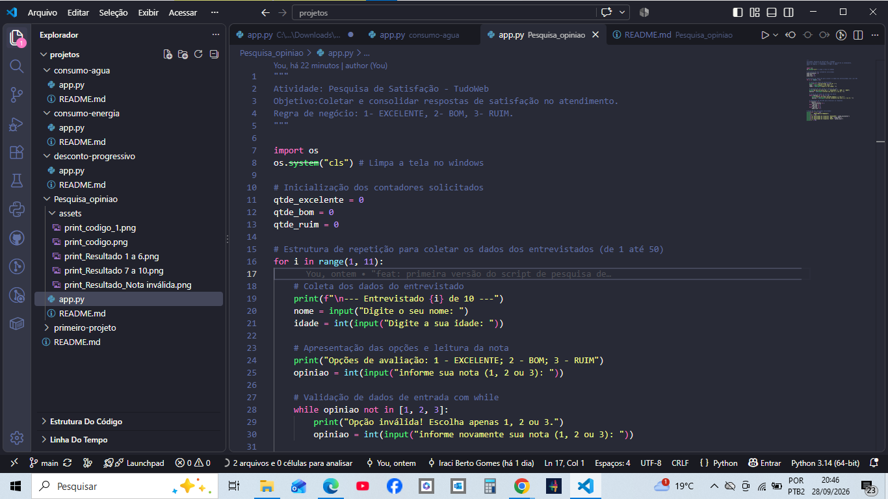
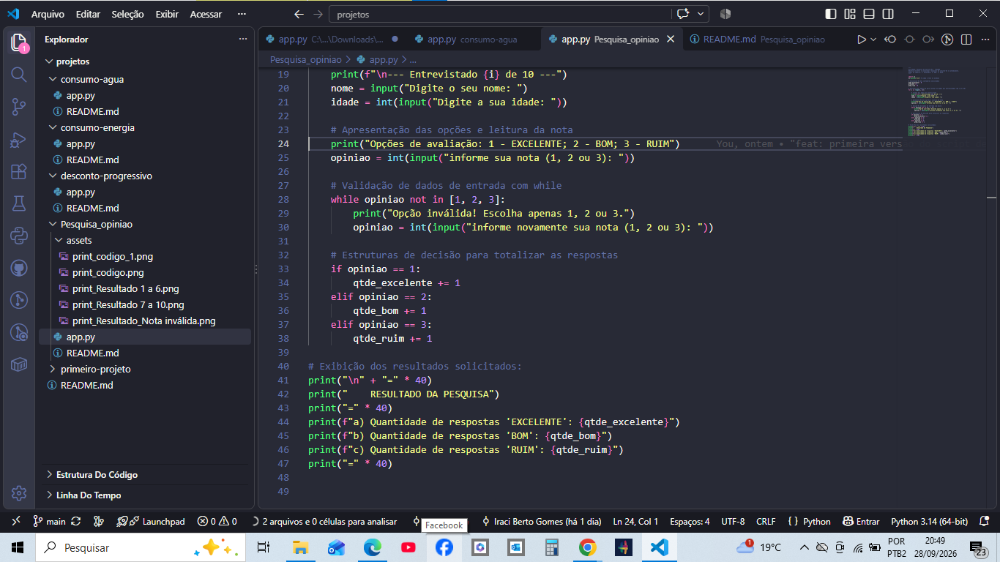

# 📊 Pesquisa de Satisfação de Atendimento — TudoWeb

<!-- Badges de Identificação Institucional e Tecnologias -->
<p align="left">
  
  
  
  
  
  
</p>

---
## 🚀 Como Executar o Projeto

Certifique-se de ter o Python instalado na sua máquina. Abra o terminal na pasta do projeto e rode o seguinte comando:

```bash
python app.py

## 🎯 O que o script faz

Este script é uma aplicação de terminal desenvolvida em Python para automatizar a coleta e o processamento de métricas de satisfação da empresa **TudoWeb**. 

O programa executa as seguintes operações em lote:

1. **Iteração controlada:** Executa uma rotina sequencial para processar **50 entrevistados** (`for i in range(1, 51)`), permitindo também amostragem reduzida para testes.
2. **Entrada de dados cadastrais e métrica:** Coleta o `nome`, a `idade` e a nota de avaliação do atendimento de cada participante.
3. **Validação de entrada:** Intercepta opções numéricas fora do menu previsto (`1`, `2` ou `3`). Caso o usuário digite um número inválido, o laço de repetição condicional exige uma nova digitação até que um valor correto seja fornecido.
4. **Limpeza inicial do terminal:** Executa `os.system("cls")` na inicialização do script para preparar a interface de console no ambiente Windows.
5. **Apuração e relatório:** Ao término de todos os registros, totaliza e exibe no terminal a contagem de votos por categoria:
   - **"EXCELENTE"** (Opção 1)
   - **"BOM"** (Opção 2)
   - **"RUIM"** (Opção 3)

---

## ⚙️ Arquitetura e Lógica Aplicada

Como projeto da disciplina de Técnicas de Programação / Algoritmos, o código aplica conceitos essenciais de programação estruturada:

| Estrutura | Função no Código |
| :--- | :--- |
| `for i in range(1, 51)` | Laço com número pré-fixado de iterações para processar o lote de clientes (amostra nominal de 50). |
| `while opiniao not in [1, 2, 3]` | Laço condicional para validação de dados de entrada antes do cômputo. |
| `if / elif` | Estrutura de seleção encadeada para incrementar os contadores de cada categoria. |
| `os.system("cls")` | Chamada ao sistema operacional para limpeza da tela no início da execução. |

---

## 🧪 Execução do Teste Homologado (Amostra Reduzida)

Para validação rápida do fluxo e integridade da lógica de contagem, foi executado um teste de homologação com uma amostra de **10 entrevistados** (`range(1, 11)`).

### Escala de Avaliação:
* `1`: **EXCELENTE**
* `2`: **BOM**
* `3`: **RUIM**

### Saída obtida no console ao final da 10ª resposta:
```text

## 🧪 Execução do Teste Homologado

### Escala de Avaliação:
* `1`: **EXCELENTE** *(computado no relatório final)*
* `2`: **BOM** *(computado no relatório final)*
* `3`: **RUIM** *(computado no relatório final)*

### Saída esperada no console ao final da 10ª resposta:
```text
========================================
         RESULTADO DA PESQUISA
========================================
a) Quantidade de respostas 'EXCELENTE': 4
b) Quantidade de respostas 'BOM': 3
c) Quantidade de respostas 'RUIM': 3
========================================
---

## 📸 Galeria e Demonstração do Sistema

Abaixo estão os registros visuais do funcionamento e execução do script:

**1. Estrutura Inicial do Código**  


**2. Início da Coleta de Dados**  


**3. Terminal durante as Entrevistas de 01 a 06**  


**4. Terminal com as Entrevistas de 07 a 10 e a Consolidação dos Resultados**  


**5. 3. Validação de Opção Inválida (Tratamento de Erro)**  


---

## 👩‍💻 Autora

[](https://github.com/)
[](https://www.linkedin.com/in/iraci-berto-gomes-b63b19242/)
[](mailto:ira-33@hotmail.com)

**Estudante de Desenvolvimento de Sistemas — ETEC / Centro Paula Souza**  
Atividade Prática — Módulo de Técnicas de Programação / Algoritmos.
